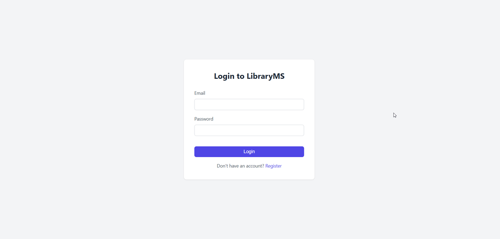
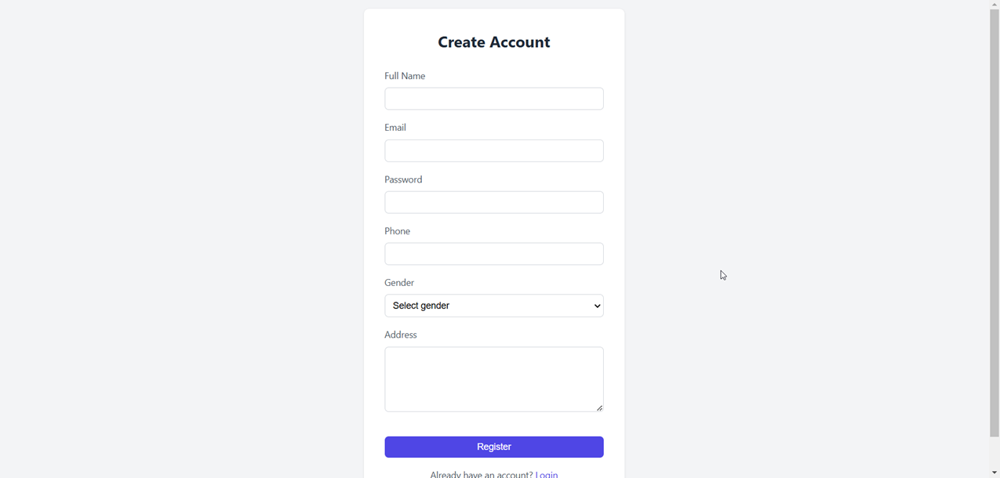
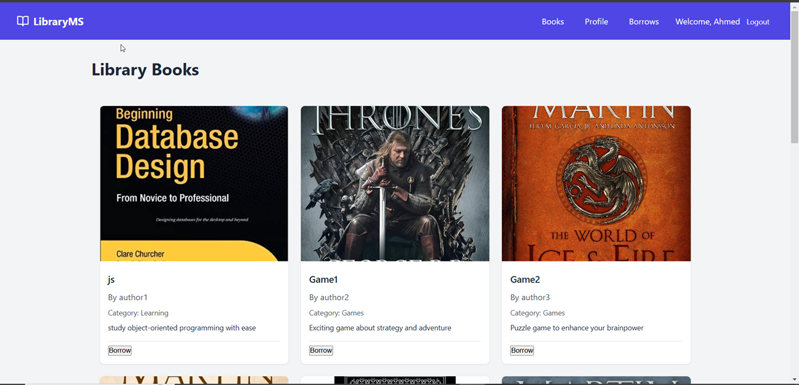
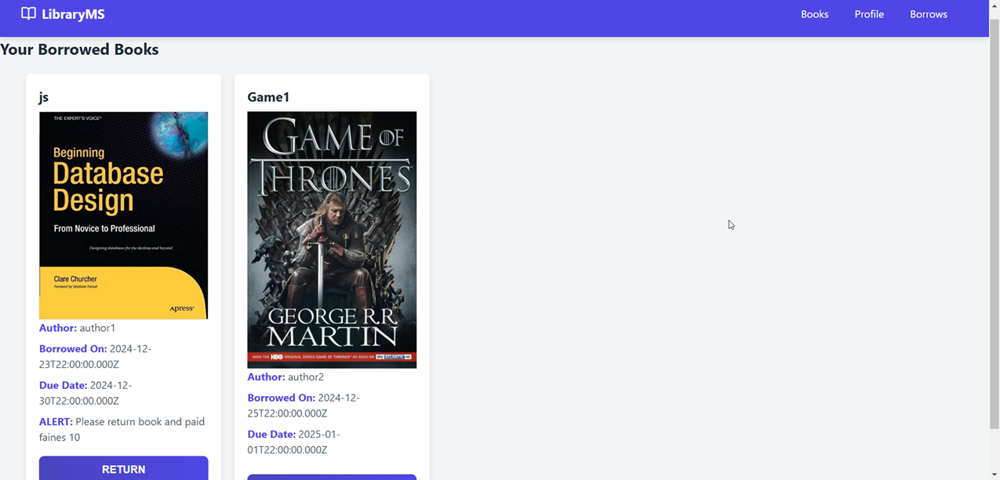
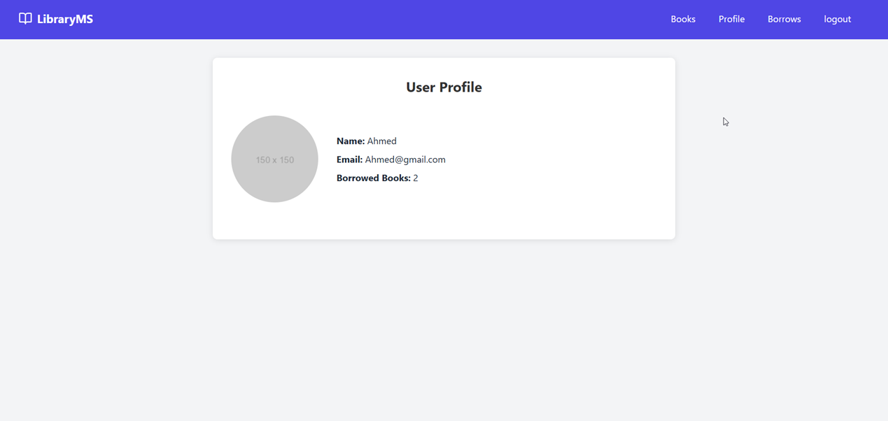
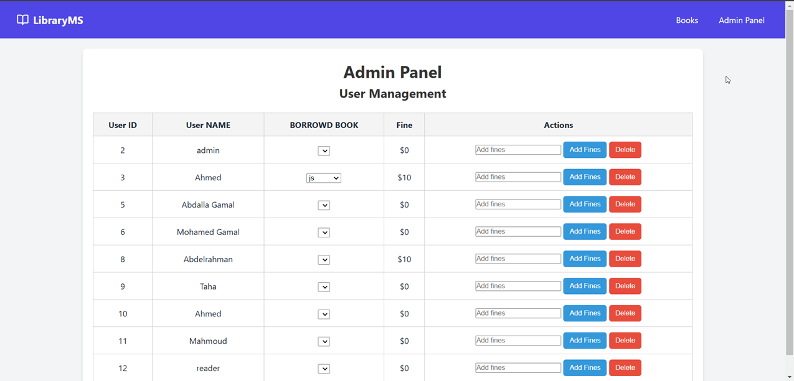
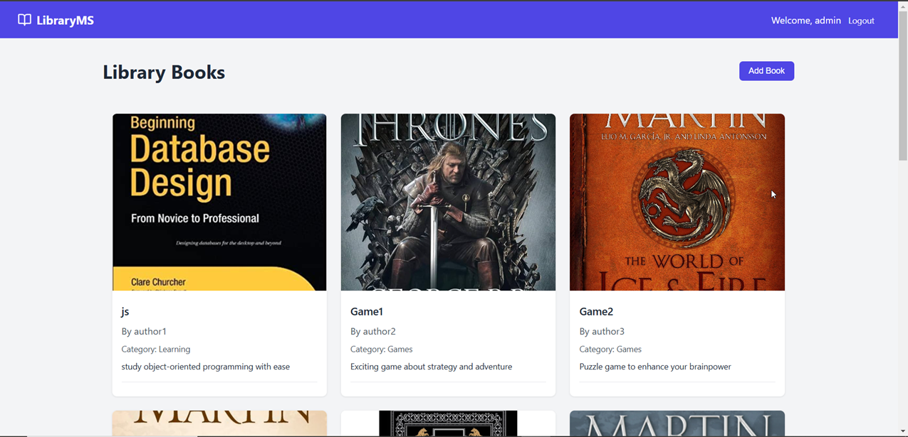

# Library Management System

## Description

The Library Management System is a robust and user-friendly software application designed to streamline the management of library resources. This system handles various tasks such as managing book inventories, member registrations, borrowing and returning of books, and calculating overdue fines. It provides an efficient solution for libraries to enhance their operations and deliver better services to their members.

## Features

- **Book Inventory Management**: Add, update, and delete book records, including details like title, author, ISBN, and availability status.
- **Member Management**: Register new members, update member information, and maintain a database of active and inactive members.
- **Borrowing and Returning**: Record book borrow and return transactions with timestamps for accurate tracking.
- **Overdue Fine Calculation**: Automatically calculate overdue fines based on the library's policies.
- **Search and Filters**: Search for books and members using various filters (e.g., title, author, member ID).
- **User Roles**: Differentiate between administrator and member functionalities for enhanced security and usability.

## Technologies Used

- **Frontend**: HTML, CSS, JavaScript (in the `public` folder)
- **Backend**: Node.js with Express
- **Database**: MySQL

## Screenshot

### User functionality

**LOGIN AND REGIST PAGES**: 

**THE BOOK PAGE (TO BORROWED BY USER) => AND THE SAMPLE I ADD IN DATABASE**:

**THE BORROWED PAGE (APPEAR THE BOOK BORRWED BY LOGINED USER)**:

**THE PROFILE PAGE (APPEAR USER DATA AND NUMBER OF BORROWED BOOK BY USER)**:

### Admin functionality

**THE ADMIN CONTROL PANAL PAGE (ADMIN SEE AL USER AND BORROWED USER BOOK AND CAN ADD FINES FOR EACH BOOK)**:

**THE ADMIN PAGE (ONLY ADMIN CAN ADD BOOK)**:

Library-Management-System/
│
├── config/ # Configuration files for the project
│ 
│
├── controllers/ # Controllers handle the business logic
│ ├── books.controller.js # Logic for managing books
│ └── member.controller.js # Logic for managing members
│
├── middlewares/ # Middleware for request validation and authorization
│ ├── allowTO.js # Middleware for role-based access control
│ └── verifyToken.js # Middleware for verifying JWT tokens
│
├── models/ # Models define the data structure and schemas
│ ├── books.js # Book schema/model
│ └── members.js # Member schema/model
│
├── node_modules/ # Dependencies installed via npm (auto-managed)
│ └── ...
│
├── public/ # Frontend assets (static files)
│ ├── css/ # Stylesheets
│ ├── js/ # Frontend JavaScript
│ └── imag/ # Images and other assets
│
├── routes/ # API route definitions
│ ├── books.route.js # Routes for books-related API
│ └── member.route.js # Routes for member-related API
│
├── utils/ # Utility functions or helper modules
│ ├── generateJWT.js # Helper for generating JWT tokens
│ └── Status.js # Utility for handling statuses
│
├── views/ # HTML templates for the frontend
│ ├── admin_control.html # Admin control panel
│ ├── admin.html # Admin dashboard
│ ├── borrows.html # Borrow/return books page
│ ├── index.html # Homepage
│ ├── login.html # Login page
│ ├── members.html # Members list page
│ ├── Profiles.html # User/member profile page
│ └── register.html # Registration page
│
├── .env # Environment variables (e.g., database URL, JWT secret)
├── .gitignore # Files and directories to ignore in Git
├── index.js # Main entry point for the application
├── package-lock.json # Auto-generated dependency tree (npm)
└── package.json # Project metadata and dependencies
